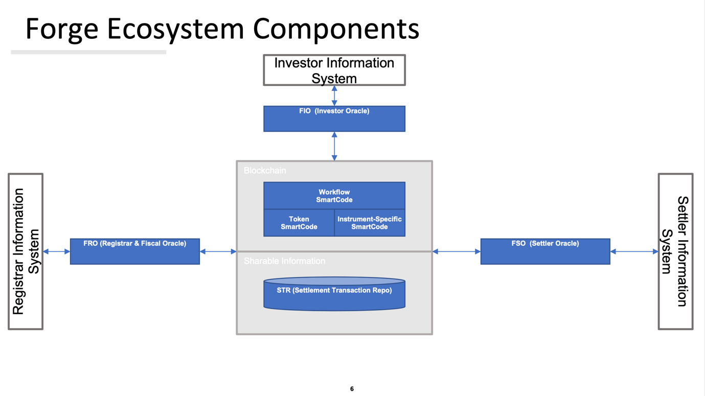

# Forge Oracle API Tutorial

## Introduction

Forge is a platform and ecosystem created by SG FORGE, the Blockchain start-up of Société Générale Group.

Forge rose from the need to have a complete Blockchain financial management platform that gives equal importance to Legal, Operational and Technical aspects.

To achieve this need it is very clear that creating yet another lone platform is not the goal.

Forge wants to onboard as many ecosystem members as possible by publishing open-source protocols, components and tools to encourage adoption.

Hence, even if the open-sourcing process is still ongoing, we are ready to start sharing the API.

Please also note that changes to the legal environment could necessitate technical changes.
Ecosystem members will be notified in the event of any technical changes.

## Goal of the Document

This document is targeted to ecosystem members who want to play a financial role using the SaaS integration.

This document, together with the authentication instructions, should be sufficient for a member to connect to one of the sandbox Oracles and instruct the Oracle to perform business instructions as well as listen for incoming business events.

The business instructions would be performed on a private Ethereum chain so the member should not expect to be able to see the result on the publicly available Blockchain explorer.

We plan to deploy a private Blockchain explorer in the future.

## Description of the Forge ecosystem

As described in this diagram, the basic actor types are:

- The Registrar
- The Investor(s)
- The Settler

Each one plays its role thanks to the Oracles, by instructing the Oracle and listening to it.

The Oracles take care of turning the Business Instructions into Blockchain Transactions and confidential data stored in the STR.

Please begin with [Interating with Oracles](modules/explorerFRO.md).
